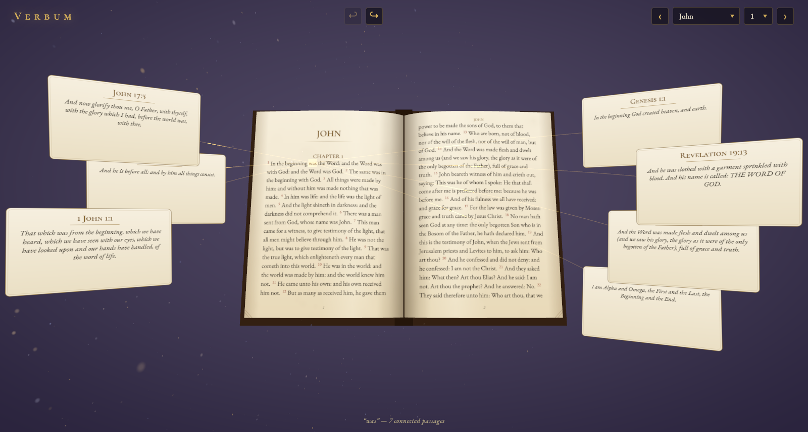

# Tolle Lege — a 3D Bible Study Tool

*Tolle lege* — “take up and read,” the words that sent St. Augustine to the Scriptures.

**Live: <https://dgreenheck.github.io/tolle-lege/>**

Scripture renders as an open 3D book — curved pages, typeset text, rubric-red
verse numbers, gilt fore-edges swelling past the leaves — with a fixed study
sidebar on the right. Click any word and a small glass card pops up beside it
with the Greek or Hebrew behind it: original word, transliteration, parsing,
and Strong's definition. The sidebar fills with a concordance of other
passages using the same lemma and the verse's cross-references. Drag across
words to select a passage; click a rubric verse number for that verse alone.
Any reference row riffles the book to that passage; the ↶ / ↷ history buttons
return you to your exact spot, selection included.

Place names are inked in lapis blue. Selections that touch geocoded places
get a map card below the sidebar — name chips over a satellite map — which
expands into a full-screen overlay for a closer look.



## How it works

- Pages are laid out **per book** with inline chapter headings; folio numbers
  run continuously through the whole volume.
- Page turns are a hinged two-faced mesh whose surface morphs between the
  resting page curves in the vertex stage, with a paper curl that peaks near
  the spine at mid-turn. Turns cross chapter and book boundaries.
- Word picking is raycast → page UV → typeset token rects; highlights sit on
  the curved page surface, and the word popover is anchored by projecting the
  token back to screen space.
- Sidebar sections collapse individually and scroll within the card's fixed
  height.

## Stack

- **Three.js WebGPURenderer + TSL** (`three/webgpu`, `three/tsl`) — the page
  flip morph, background vignette, and gilt edge shading are node materials.
  Falls back to WebGL2 automatically where WebGPU is unavailable.
- **Plain DOM study panels** — the sidebar, map card, and word popover are
  real HTML for crisp typography, selectable text, and accessible reference
  lists; only the book itself lives on the canvas.
- **Leaflet** for the map widget (Esri World Imagery tiles).
- **Vite**, no framework.

## Data

Generated by `npm run data` (gitignored, ~48 MB):

- **Text**: [Berean Standard Bible](https://berean.bible) (public domain).
- **Word-level alignment**: the BSB translation tables (public domain) map
  every English word to its Hebrew/Greek source word, Strong's number,
  transliteration, and morphological parsing. The pipeline matches each
  table entry to the verse's display tokens (98.7% of tagged words align).
- **Lexicon**: Strong's Hebrew and Greek dictionaries from
  [Open Scriptures](https://github.com/openscriptures/strongs) (CC-BY-SA),
  sharded by Strong's number and merged with per-lemma occurrence lists
  (sampled evenly across the canon, capped at 60).
- **Cross-references**: ~340,000 weighted verse connections from
  [OpenBible.info](https://www.openbible.info/labs/cross-references/) (CC-BY),
  derived from the Treasury of Scripture Knowledge. Validated against the
  text, downvoted links dropped, top 14 kept per verse. The BSB shares the
  dataset's Hebrew (KJV) versification, so references line up without
  remapping.
- **Place geocoding**: 1,278 identified places from the
  [OpenBible.info Bible Geocoding data](https://github.com/openbibleinfo/Bible-Geocoding-Data)
  (CC-BY). Each place's translation spellings are matched against the BSB
  verse tokens (commonest spelling first, proper-noun capitalization
  required), giving word-level highlights for ~91% of verse–place pairs;
  the rest still appear on the verse's map.

## Run

```sh
npm install
npm run data   # one-time: download + process text, references, places
npm run dev
```

Deep links: `/#Bookname.Chapter` (OSIS id), plus `?sel=verse[.wordIndex]` to
open a selection on load — e.g. `/?sel=28.4#John.1` lands on Bethany.

`node scripts/snap.mjs <url> <out.png> [waitMs] [x,y[,afterMs]]
[drag:x1,y1,x2,y2[,afterMs]] [eval:expr]` screenshots the app in headless
Chrome over CDP (dev helper); click, drag, and eval actions run in order.

## Deploy

Pushes to `main` deploy automatically to GitHub Pages via
[`.github/workflows/deploy.yml`](.github/workflows/deploy.yml): the workflow
rebuilds the data (source downloads cached between runs), runs `vite build`
with the `/tolle-lege/` base path, and publishes `dist/`.

## Ideas for later

- Commentary panel: Church Fathers per verse
  ([HistoricalChristianFaith](https://github.com/HistoricalChristianFaith/Commentaries-Database))
  and public-domain commentaries via the [HelloAO API](https://bible.helloao.org/docs/)
- Parallel translations section in the sidebar
- AI-generated meditations on a selected passage (Claude API)
- A zoomed-out "galaxy" view of all 31k verses with the full arc set
